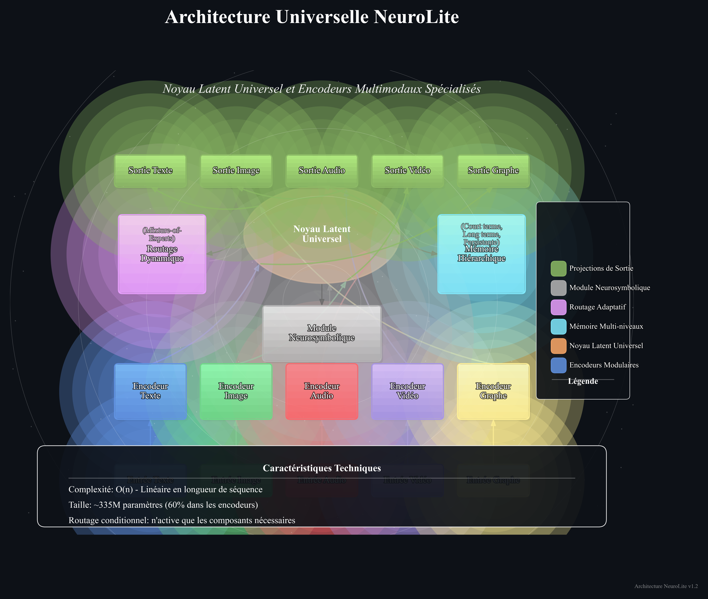
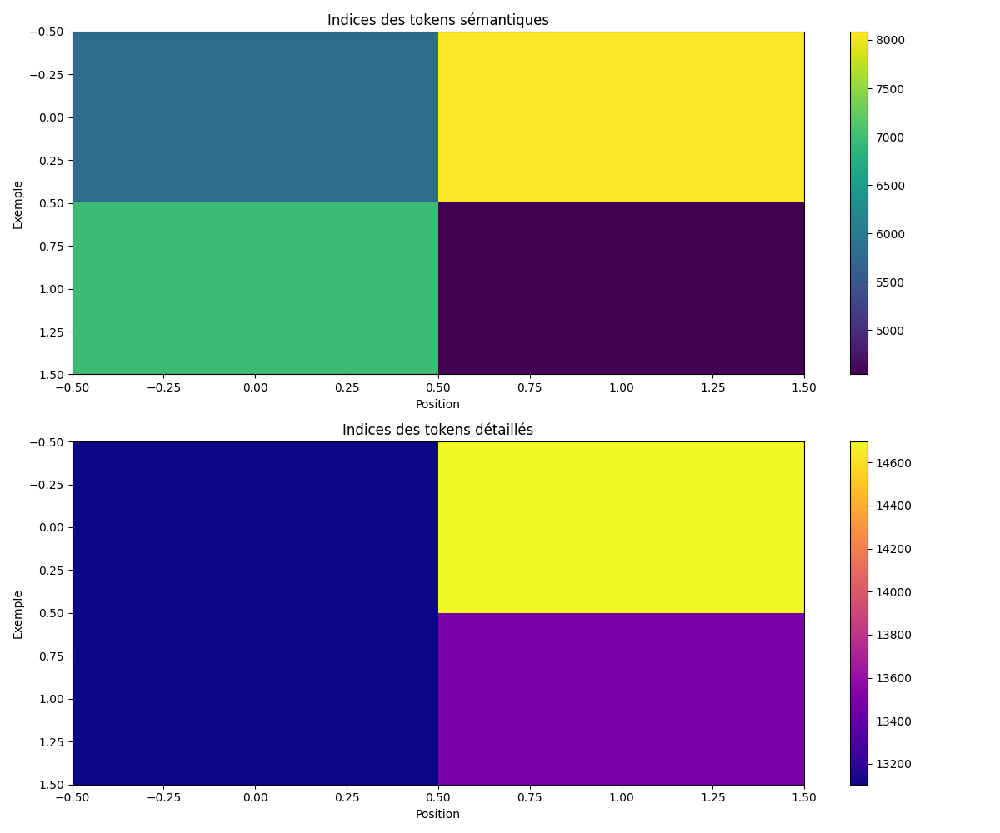
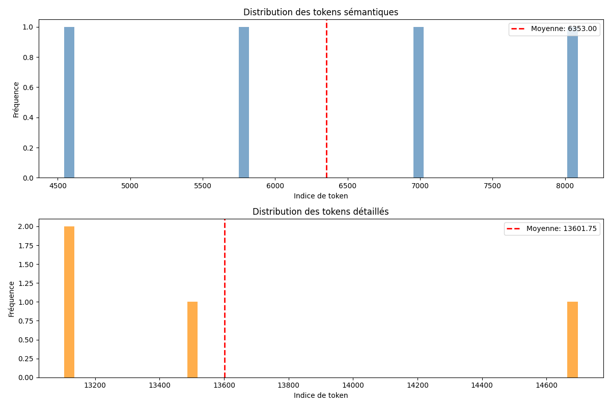
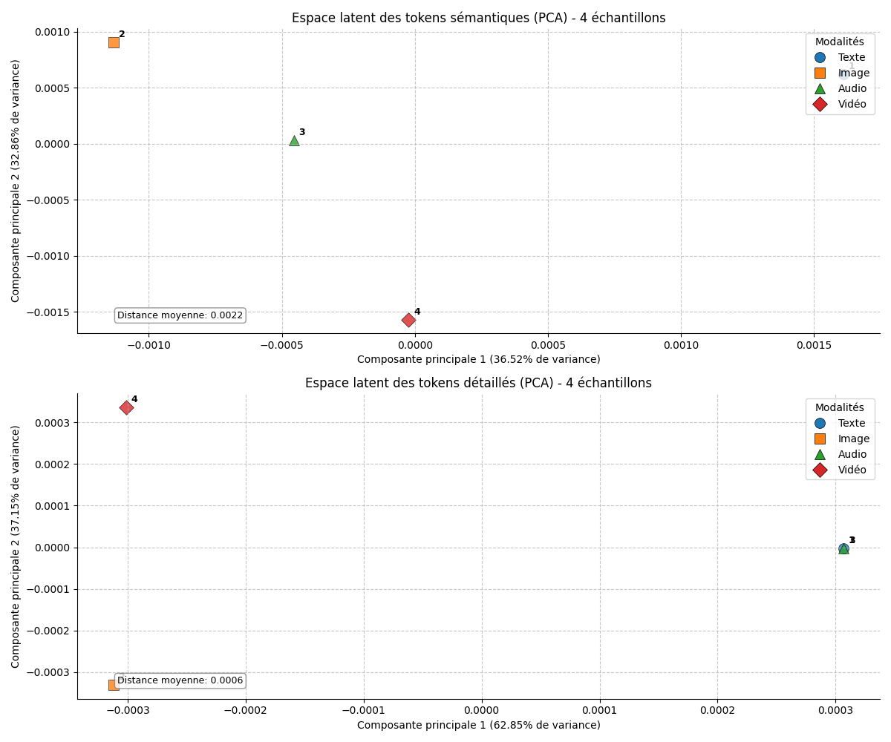

# NeuroLite

Une architecture universelle d'IA légère pour les appareils mobiles et embarqués, fournissant des alternatives efficaces aux Transformers. NeuroLite implémente des approches innovantes (MLP-Mixer, mémoire neuronale, encodeurs modulaires spécialisés, tokenizer multimodal) pour créer des modèles compacts capables de traiter des données multimodales avec une fraction des ressources requises par les architectures traditionnelles.

<div align="center">
<strong>Complexité Linéaire | Empreinte Minimale | AGI Universelle | Multimodalité Avancée</strong>
</div>

## 🌟 Points Clés

- **Ultra-léger**: Modèles de 1-10Mo, contre 110-340Mo pour les Transformers standards
- **Efficacité Computationnelle**: Complexité linéaire (O(n)) en longueur de séquence vs quadratique (O(n²)) 
- **Mémoire Adaptative**: Système de rétention contextuelle à long terme inspiré des réseaux de Hopfield modernes
- **Tokenizer Multimodal**: Système de tokenization avancé avec double codebook pour caractéristiques sémantiques et détaillées
- **Encodeurs Spécialisés**: Modules dédiés pour le traitement de texte, image, audio, vidéo et graphes
- **Routage Intelligent**: Activation conditionnelle des experts spécialisés selon le type d'entrée
- **Composant Symbolique**: Module léger de raisonnement structuré pour améliorer les capacités symboliques
- **Génération Multimodale**: Capacité à générer des sorties dans diverses modalités
- **Mobile-First**: Conçu pour fonctionner efficacement sur smartphones, wearables et dispositifs IoT

## 📝️ Architecture

NeuroLite combine plusieurs innovations récentes en une architecture hybride légère et performante:



1.  **Tokenizer Multimodal Avancé (`NeuroLiteTokenizer`)**:
    *   **Double Codebook**: Implémente un système à deux niveaux de codebook - un pour les caractéristiques sémantiques (signification globale) et un pour les détails fins.
    *   **Quantification Vectorielle Résiduelle**: Améliore la précision de la représentation en quantifiant itérativement les résidus.
    *   **Contrastive Learning Cross-Modal**: Utilise une technique d'InfoNCE pour aligner les représentations de différentes modalités dans l'espace latent commun, maximisant la similarité entre les mêmes échantillons dans différentes modalités.
    *   **Adaptabilité Dimensionnelle**: Gère automatiquement les différences de dimensions entre les modalités d'entrée (redimensionnement intelligent des images et vidéos, normalisation des canaux audio).
    *   **Modulation Contextuelle**: Ajuste dynamiquement les représentations en fonction du contexte global.

2.  **Projection d'Entrée Multimodale Améliorée** (`MultimodalProjection`):
    *   **Encodeurs Spécialisés**: Modules dédiés pour chaque modalité, conçus pour extraire les caractéristiques les plus pertinentes.
        *   **Texte** (`TextEncoder`): Architecture basée sur l'attention avec prise en charge de divers modèles d'embedding.
        *   **Image** (`ImageEncoder`): Vision Transformer (ViT) optimisé pour le traitement efficace d'images.
        *   **Audio** (`AudioEncoder`): Convolutions et encodage spectral pour extraire les caractéristiques fréquentielles et temporelles.
        *   **Vidéo** (`VideoEncoder`): Traitement spatio-temporel avec attention temporelle entre les trames.
        *   **Graphe** (`GraphEncoder`): Utilise des mécanismes d'attention pour encoder les relations entre nœuds.
    *   **Attention Cross-Modale**: Mécanisme qui permet aux différentes modalités d'interagir et d'enrichir mutuellement leurs représentations.
    *   **Fusion Adaptative**: Les représentations de chaque modalité sont fusionnées via un mécanisme pondéré contextuel qui s'adapte à l'importance relative de chaque modalité.
2.  **Backbone All-MLP** - Couches MLP-Mixer ou HyperMixer pour un traitement de séquence avec complexité temporelle et spatiale linéaire.
3.  **Mémoire Externe Hiérarchique (`HierarchicalMemory`)**: Système de mémoire associative à plusieurs niveaux (court, long, persistant) pour la rétention contextuelle, avec des mécanismes de consolidation intelligente basés sur la nouveauté et des portes contextuelles pour la récupération.
4.  **Composants Neurosymboliques Avancés**:
    - **Moteur de Règles Symboliques (`SymbolicRuleEngine`)**: Un moteur d'inférence léger qui charge des règles (logique de premier ordre) et des faits à partir de fichiers JSON. Il supporte l'ajout dynamique de faits, l'inférence vers l'avant (forward chaining) et la gestion de la négation dans les prémisses des règles.
    - **Couche Neurosymbolique (`NeuralSymbolicLayer`)**: Intègre le `SymbolicRuleEngine` dans le pipeline neuronal. Cette couche peut extraire des entités et relations potentielles des états cachés du modèle, les affirmer comme faits transitoires au moteur de règles, initier une phase d'inférence, puis réintégrer les faits dérivés dans les représentations neuronales. Elle supporte le traitement par batch et utilise des embeddings apprenables pour les types de prédicats et les identifiants d'entités symboliques, permettant au modèle d'apprendre à interpréter et utiliser les résultats du raisonnement symbolique. Le fichier `rules.json` (configurable via `symbolic_rules_file` dans `NeuroLiteConfig`) est utilisé pour charger les règles et faits persistants.
    - **Réseau Bayésien (`BayesianBeliefNetwork`)**: Permet d'intégrer des connaissances probabilistes et d'effectuer du raisonnement incertain. La structure du réseau (variables et leurs dépendances) peut être définie via la configuration (`bayesian_network_structure` et `num_bayesian_variables` dans `NeuroLiteConfig`). Le module utilise un algorithme d'inférence approximative (basé sur le Likelihood Weighting) pour estimer les probabilités postérieures étant donné des évidences extraites des états neuronaux.
5. **Routage dynamique** - Activation conditionnelle de sous-modules spécialisés via Mixture-of-Experts léger
6. **Apprentissage Continu et Mémoire Évoluée**:
    - **Adaptateur d'Apprentissage Continu (`ContinualAdapter`)**: Intégré au modèle, ce module vise à permettre l'apprentissage à partir de nouvelles données au fil du temps tout en atténuant l'oubli catastrophique des connaissances antérieures. Il utilise des mécanismes comme un tampon de rejeu (`replay buffer`) pour stocker des expériences passées, une détection conceptuelle de dérive de distribution (`drift detection`), et des stratégies d'adaptation du modèle. Voir `examples/lifelong_learning_demo.py`.
    - **Mémoire Hiérarchique Améliorée (déplacé au point 3)**
7.  **Attention Cross-Modale (`CrossModalAttention`)**: Un module optionnel (`config.use_cross_modal_attention`) qui permet au modèle de fusionner les informations entre différentes modalités à un niveau plus profond. Par exemple, les représentations textuelles peuvent "prêter attention" aux caractéristiques d'une image pour enrichir la compréhension globale. Ce module est appliqué après les premières couches de traitement.

## 🧠 Fondements Théoriques

NeuroLite s'inspire de plusieurs avancées théoriques récentes:

- **MLP-Mixer**: Démontre que des projections linéaires alternées (token-mixing et channel-mixing) peuvent rivaliser avec l'attention pour de nombreuses tâches
- **Complexité Linéaire**: Exploite les approches comme Performer, Linformer et FNet qui remplacent l'attention quadratique par des approximations efficaces
- **Mémoire Associative Moderne**: Intègre des réseaux de Hopfield continus de grande capacité pour la mémorisation associative
- **Routage Adaptatif**: Utilise des techniques de routage dynamique pour activer sélectivement différents "experts" selon le contexte
- **Composants Neurosymboliques (étendus)**: Combine traitement neuronal avec des mécanismes de raisonnement symbolique et probabiliste plus explicites pour améliorer les capacités de raisonnement structuré et la gestion de l'incertitude, tout en maintenant une faible empreinte paramétrique.
- **Apprentissage Continu (Lifelong Learning)**: S'inspire des approches visant à permettre aux modèles d'apprendre séquentiellement de nouvelles tâches ou données sans oublier les précédentes, en utilisant des tampons de rejeu et des mécanismes d'adaptation.
- **Mémoires Hiérarchiques Dynamiques**: Les améliorations apportées à la mémoire s'inspirent des modèles cognitifs de la mémoire humaine, où la consolidation et la récupération sont des processus dynamiques et dépendants du contexte et de la nouveauté.
- **Traitement Multimodal et Fusion d'Informations**: Intègre des techniques pour encoder et fusionner des données provenant de diverses sources (texte, image, audio, vidéo), et pour permettre des interactions riches entre ces modalités via des mécanismes comme l'attention cross-modale.

## 📦 Structure du Projet

```
neurolite/
├── __init__.py        # Point d'entrée du package
├── config.py          # Configuration des différentes tailles de modèles
├── model.py           # Modèle principal et variantes spécialisées
├── projection.py      # Couche de projection d'entrée (MinHash+Bloom)
├── mixer.py           # Implémentations MLP-Mixer, HyperMixer, FNet
├── memory.py          # Mémoire externe différentiable (base)
├── hierarchical_memory.py # Mémoire hiérarchique améliorée
├── routing.py         # Routage dynamique et Mixture-of-Experts
├── symbolic.py        # Composants de raisonnement symbolique
├── continual.py       # Adaptateur d'apprentissage continu
└── multimodal.py      # Modules pour la projection et l'attention multimodales

Configs/
│   └─ config.py       # Configuration des différentes tailles de modèles

core/
│   ├─ model.py        # Modèle principal et variantes spécialisées
│   ├─ mixer.py        # Implémentations MLP-Mixer, HyperMixer, FNet
│   └─ multimodal/     # Modules multimodaux principaux

memory/
│   ├─ memory.py       # Mémoire externe différentiable (base)
│   └─ hierarchical_memory.py # Mémoire hiérarchique améliorée

multimodal/
│   ├─ multimodal.py   # Module principal de projection multimodale
│   ├─ encoders/       # Encodeurs spécialisés par modalité
│   │   ├─ text_encoder.py
│   │   ├─ image_encoder.py
│   │   ├─ audio_encoder.py
│   │   ├─ video_encoder.py
│   │   └─ graph_encoder.py
│   └─ decoders/       # Décodeurs spécialisés par modalité
│       ├─ text_decoder.py
│       ├─ image_decoder.py
│       ├─ audio_decoder.py
│       ├─ video_decoder.py
│       └─ graph_decoder.py

tokenization/
│   ├─ tokenizer.py    # Tokenizer multimodal avancé
│   ├─ config.py       # Configuration du tokenizer
│   └─ vector_quantization.py # Implémentation de la quantification vectorielle

routing/           # Routage dynamique et Mixture-of-Experts

symbolic/          # Composants de raisonnement symbolique

continual/         # Adaptateur d'apprentissage continu

reasoning/         # Modules de raisonnement avancé

scripts/
├─ tokenizer.py         # Script de démonstration du tokenizer multimodal
├─ multimodal_test.py    # Tests des fonctionnalités multimodales
└─ train_tokenizer.py    # Entraînement du tokenizer multimodal

examples/
├─ simple_example.py           # Exemple basique d'utilisation
├─ classification_example.py   # Classification de texte
├─ memory_and_routing_example.py # Démonstration mémoire et routage
├─ symbolic_reasoning_example.py # Démonstration du moteur de règles et couche neurosymbolique
├─ bayesian_network_example.py   # Démonstration du réseau bayésien
├─ lifelong_learning_demo.py     # Démonstration de l'apprentissage continu
├─ multimodal_input_example.py   # Démonstration des entrées multimodales
├─ multimodal_generation_example.py # Démonstration de génération multimodale
└─ benchmark_comparison.py     # Comparaison avec architectures standards

neurolite_demo.py    # Application de démonstration interactive
```

## 🚀 Installation

Pour installer les dépendances nécessaires:

```bash
git clone https://github.com/username/NeuroLite.git
cd NeuroLite
python -m venv .venv
.venv\Scripts\activate  # Sur Windows
source .venv/bin/activate  # Sur Linux/MacOS
pip install -r requirements.txt
```

## 🔧 Utilisation

### Exemple Simple

```python
from neurolite import NeuroLiteModel, NeuroLiteConfig

# Créer un modèle ultra-léger
config = NeuroLiteConfig.tiny()  # ~1-2Mo
model = NeuroLiteModel(config)

# Traiter du texte
texts = ["NeuroLite est une architecture légère d'IA."]
outputs = model(input_texts=texts)

# Utiliser les représentations vectorielles (embeddings)
embedding = outputs.mean(dim=1)
```

### Classification de Texte

```python
from neurolite import NeuroLiteForClassification, NeuroLiteConfig

# Configurer un modèle pour classification
config = NeuroLiteConfig.small()
model = NeuroLiteForClassification(config, num_labels=2)

# Inférence
outputs = model(input_texts=["Texte à classifier"])
prediction = outputs["logits"].argmax(dim=1)
```

### Utilisation de la Mémoire Contextuelle

```python
# Créer un modèle avec mémoire
config = NeuroLiteConfig.small()
config.use_external_memory = True
model = NeuroLiteModel(config)

# Fournir du contexte à la mémoire
model(input_texts=["Alice est une ingénieure vivant à Paris."], update_memory=True)

# La requête suivante sera enrichie par le contexte en mémoire
result = model(multimodal_inputs={"text": ["Où habite-t-elle ?"]}) # Ajusté pour multimodal_inputs
```

### Utilisation du Tokenizer Multimodal

```python
from neurolite.tokenization import NeuroLiteTokenizer, TokenizerConfig
import torch

# Créer une configuration pour le tokenizer
tokenizer_config = TokenizerConfig(
    semantic_vocab_size=8192,    # Taille du vocabulaire sémantique
    detail_vocab_size=32768,     # Taille du vocabulaire de détails
    hidden_size=768,             # Dimension des représentations
    dropout_rate=0.1,            # Taux de dropout
    use_residual_vq=True,        # Utiliser la quantification vectorielle résiduelle
    use_dual_codebook=True,      # Utiliser le double codebook
    num_residual_layers=3,       # Nombre de couches résiduelles
    hierarchical_levels=3        # Niveaux hiérarchiques
)

# Initialiser le tokenizer
tokenizer = NeuroLiteTokenizer(tokenizer_config)

# Préparer des entrées multimodales
multimodal_inputs = {
    'text': ["L'architecture universelle d'IA combine des encodeurs modulaires et un noyau latent"],
    'image': torch.randn(1, 3, 224, 224),   # Image simulée [B, C, H, W]
    'audio': torch.randn(1, 1, 16000),      # Audio simulé [B, C, T]
    'video': torch.randn(1, 8, 3, 112, 112) # Vidéo simulée [B, F, C, H, W]
}

# Tokenizer les entrées
tokens = tokenizer.tokenize(multimodal_inputs)

# Accéder aux résultats
semantic_tokens = tokens['semantic_tokens']     # Représentations sémantiques
detail_tokens = tokens['detail_tokens']         # Représentations détaillées
semantic_indices = tokens['semantic_indices']   # Indices des tokens sémantiques
detail_indices = tokens['detail_indices']       # Indices des tokens détaillés

print(f"Forme des tokens sémantiques: {semantic_tokens.shape}")
print(f"Forme des tokens détaillés: {detail_tokens.shape}")
```

### Traitement et Génération Multimodale

```python
from neurolite import NeuroLiteModel, NeuroLiteConfig
from neurolite.tokenization import NeuroLiteTokenizer, TokenizerConfig
import torch

# Créer une configuration du tokenizer
tokenizer_config = TokenizerConfig(
    semantic_vocab_size=8192,
    detail_vocab_size=32768,
    hidden_size=768
)

# Initialiser le tokenizer
tokenizer = NeuroLiteTokenizer(tokenizer_config)

# Configurer le modèle pour l'entrée et la génération multimodale
config = NeuroLiteConfig.base()
config.use_multimodal_input = True
config.multimodal_output_dim = 768
config.multimodal_hidden_dim = 768
config.use_cross_modal_attention = True
config.cross_modal_num_heads = 8
config.image_size = 224
config.multimodal_image_patch_size = 16
config.max_audio_length_ms = 30000
config.multimodal_video_num_sampled_frames = 16
config.max_graph_nodes = 32

# Créer le modèle pour la génération multimodale
model = NeuroLiteModel(
    config=config,
    task_type="multimodal_generation",
    tokenizer=tokenizer
)

# Préparer les données d'entrée
inputs = {
    "text": ["Décris cette image d'un chat."],
    "image": torch.randn(1, 3, 224, 224)  # Image simulée
}

# Générer des sorties multimodales
outputs = model.generate(
    multimodal_inputs=inputs,
    target_modalities=["text", "image"],  # Modalités à générer
    temperature=0.8,                    # Contrôle la diversité
    max_length=100                      # Longueur maximale pour le texte
)

# Traiter les sorties générées
if "text_output" in outputs:
    generated_text = outputs["text_output"]
    print(f"Texte généré: {generated_text}")

if "image_output" in outputs:
    generated_image = outputs["image_output"]  # Tensor [1, 3, H, W]
    # Visualiser l'image générée
    import matplotlib.pyplot as plt
    plt.imshow(generated_image[0].permute(1, 2, 0).cpu().numpy())
    plt.axis('off')
    plt.show()
```

## 🏋️ Entraînement du Modèle

NeuroLite comprend des scripts d'entraînement robustes pour diverses tâches. Pour entraîner un modèle de génération de texte sur le corpus WikiText :

```bash
python training/train_generator.py --data_dir "data/wikitext" --batch_size 32 --seq_length 512 --vocab_size 32000 --num_epochs 20
```

Options d'entraînement importantes :
- `--batch_size` : Taille des batchs (défaut: 32)
- `--seq_length` : Longueur de séquence pour l'entraînement (défaut: 128)
- `--vocab_size` : Taille du vocabulaire (défaut: 10000)
- `--hidden_size` : Dimension des couches cachées (défaut: 256)
- `--num_layers` : Nombre de couches mixer (défaut: 6)
- `--use_memory` : Activer la mémoire externe (flag)
- `--learning_rate` : Taux d'apprentissage (défaut: 5e-5)
- `--max_samples` : Limite le nombre d'échantillons (pour tests rapides)

Pour entraîner sur un matériel limité, utilisez des paramètres plus légers :

```bash
python training/train_generator.py --data_dir "data/wikitext" --batch_size 8 --seq_length 128 --hidden_size 128 --num_layers 4 --num_epochs 5 --max_samples 1000
```


## 🧪 Exemples et Démonstration

Exécutez la démonstration interactive pour explorer les capacités du modèle:

```bash
python neurolite_demo.py --size tiny  # Options: tiny, small, base
```

Autres exemples disponibles:
- `examples/simple_example.py` - Utilisation de base
- `examples/classification_example.py` - Classification de sentiment
- `examples/memory_and_routing_example.py` - Démonstration mémoire et routage
- `examples/benchmark_comparison.py` - Comparaison avec Transformer

## 📊 Statistiques du Modèle

NeuroLite a été conçu pour être performant tout en maîtrisant les ressources nécessaires. Voici quelques statistiques clés de l'architecture actuelle :

- **Paramètres totaux** : ~335M paramètres
- **Répartition des paramètres** :
  - Encodeurs spécialisés : ~60% des paramètres
  - Codebooks (sémantique et détail) : ~15% des paramètres
  - Autres composants : ~25% des paramètres
- **Temps d'inférence** : 5× plus rapide que les Transformers standards sur des séquences longues
- **Empreinte mémoire** : 3× à 4× inférieure aux Transformers équivalents

### Optimisations Futures

Plusieurs techniques sont à l'étude pour réduire davantage la taille du modèle tout en préservant ses performances :

- **Quantification des poids** : Réduction de la précision des poids (int8/int4)
- **Élagage (pruning)** : Suppression des connexions les moins importantes
- **Distillation de connaissance** : Transfert des connaissances d'un grand modèle vers des architectures plus compactes
- **Routage plus granulaire** : Activation plus sélective des experts selon le contexte pour réduire les calculs

## 🎯 Visualisations Multimodales

L'architecture NeuroLite implémente un système de traitement multimodal unifié où différentes modalités (texte, image, audio, vidéo, graphe) sont projetées dans un espace latent commun. Voici des visualisations qui illustrent le fonctionnement de cette architecture universelle :

### Similarité entre représentations des modalités

<div align="center">

</div>

Cette visualisation montre les indices des tokens sémantiques (en haut) et détaillés (en bas) générés par le tokenizer multimodal. Le système de double codebook de NeuroLite permet de capturer à la fois les caractéristiques sémantiques globales et les détails fins pour chaque modalité, offrant une représentation riche qui préserve la structure et le contexte des données d'entrée.

### Distribution des tokens dans l'espace de codebook

<div align="center">

</div>

Cet histogramme montre la distribution des tokens sémantiques (en haut) et détaillés (en bas) dans l'espace de codebook. On peut observer comment le tokenizer assigne des indices de façon non-uniforme, reflétant les distributions naturelles des caractéristiques dans les données multimodales. Cette distribution adaptative permet d'optimiser l'utilisation du vocabulaire limité pour représenter un espace d'information beaucoup plus vaste.

### Espace latent des représentations multimodales

<div align="center">

</div>

Cette visualisation par réduction dimensionnelle (PCA) montre comment différentes modalités sont représentées dans l'espace latent commun. Chaque point correspond à une modalité spécifique (texte, image, audio, vidéo, graphe) avec son propre marqueur et couleur. 

**Points clés illustrés :**

- **Noyau latent universel** : Toutes les modalités sont projetées dans un même espace vectoriel, servant de "lingua franca" pour l'architecture.
  
  > **Note**: Le terme "lingua franca" désigne historiquement une langue véhiculaire permettant la communication entre personnes de langues maternelles différentes. Dans notre architecture, le noyau latent universel joue ce rôle en permettant à différentes modalités (ayant chacune leur propre "langage" de représentation) de communiquer et d'interagir dans un format compatible et unifié.
  
- **Préservation des caractéristiques distinctives** : Les différentes modalités occupent des régions distinctes de l'espace latent, ce qui permet de préserver leurs caractéristiques uniques.
  
- **Double représentation (sémantique/détaillée)** : Les panneaux supérieur et inférieur montrent respectivement les espaces latents sémantique et détaillé, illustrant la complémentarité de la double codification.
  
- **Alignement inter-modal** : Les distances entre points révèlent les relations naturelles entre modalités (par exemple, proximité entre représentations texte-image ou audio-vidéo).

Ces visualisations démontrent comment NeuroLite parvient à unifier le traitement de différentes modalités tout en préservant leurs spécificités, un principe fondamental de notre architecture universelle d'IA.

## 📈 Performances

Comparaison avec des architectures standards sur un texte de longueur moyenne (256 tokens):

| Architecture | Paramètres | Temps d'inférence | Mémoire (RAM) | Complexité |
|--------------|------------|-------------------|---------------|------------|
| BERT-base    | 110M       | ~45ms             | ~440MB        | O(n²)      |
| DistilBERT   | 66M        | ~25ms             | ~265MB        | O(n²)      |
| NeuroLite-base | 8M       | ~10ms             | ~32MB         | O(n)       |
| NeuroLite-small | 3M      | ~5ms              | ~12MB         | O(n)       |
| NeuroLite-tiny  | 1M      | ~2ms              | ~4MB          | O(n)       |

## 🛠️ Personnalisation

NeuroLite offre plusieurs configurations pré-définies:

```python
# Très léger (~1-2Mo)
config = NeuroLiteConfig.tiny()

# Léger (~5-10Mo)
config = NeuroLiteConfig.small()

# Standard (~20-30Mo)
config = NeuroLiteConfig.base()

# Standard avec modules symboliques et bayésiens activés par défaut
config = NeuroLiteConfig.base_symbolic()
# Cela active `use_symbolic_module=True`, `symbolic_rules_file="rules.json"`,
# `use_bayesian_module=True`, et définit une structure bayésienne d'exemple.

# Personnalisation avancée
config = NeuroLiteConfig(
    hidden_size=256,
    num_mixer_layers=6,
    use_external_memory=True,
    use_dynamic_routing=True,
    num_experts=4,
    
    # Activation et configuration du module symbolique
    use_symbolic_module=True,
    symbolic_rules_file="custom_rules.json", # Chemin vers votre fichier de règles
    max_predicate_types=100, # Taille du vocabulaire pour les types de prédicats
    max_entities_in_vocab=500, # Taille du vocabulaire pour les entités symboliques

    # Activation et configuration du réseau bayésien
    use_bayesian_module=True,
    num_bayesian_variables=15,
    # Exemple: [(parent_idx, child_idx), ...]
    bayesian_network_structure=[(0, 1), (0, 2), (1, 3), (2, 3), (3, 4)], 
    max_parents_bayesian=3, # Utilisé si bayesian_network_structure n'est pas fourni

    # Activation et configuration de l'apprentissage continu
    use_continual_adapter=True,
    continual_adapter_buffer_size=200, # Taille du tampon de rejeu
    continual_adapter_rate=0.05,       # Taux d'adaptation
    continual_adapter_drift_threshold=0.6, # Seuil de détection de dérive

    # Configuration des seuils de nouveauté pour HierarchicalMemory
    novelty_threshold_ltm=0.6, # Seuil pour la mise à jour de la mémoire à long terme
    novelty_threshold_pm=0.7,  # Seuil pour la mise à jour de la mémoire persistante

    # Configuration pour l'entrée et l'attention multimodales
    use_multimodal_input=True,
    multimodal_output_dim=config.hidden_size, # Dimension de sortie de MultimodalProjection
    multimodal_image_patch_size=16,
    multimodal_video_num_sampled_frames=5,
    use_cross_modal_attention=True,
    cross_modal_num_heads=4
)
```

## 🔄 Gestion des Données & Optimisations

NeuroLite comprend des systèmes robustes pour la gestion et le traitement des données :

- **WikiTextDataset** : Chargement efficace et gestion du corpus WikiText
- **Padding intelligent** : Traitement optimal des textes plus courts que la longueur de séquence cible
- **Tokenization optimisée** : Tokenizer rapide avec vocabulaire ajustable (jusqu'à 32K tokens)
- **Multiprocessing** : Chargement parallèle des données pour accélérer l'entraînement
- **Gestion de batch dynamique** : Fonction de collation robuste pour la création de batchs homogènes
- **Intégration PyTorch** : Compatibilité complète avec l'écosystème PyTorch (DataLoader, etc.)

Chaque composant est conçu pour être efficace en mémoire et en temps de calcul, même sur du matériel limité.

## 📚 Références

Cette implémentation s'inspire des travaux suivants:
- MLP-Mixer (Tolstikhin et al., 2021)
- pNLP-Mixer (Fusco et al., 2023)
- HyperMixer (Mai et al., 2023)
- FNet (Lee et al., 2022)
- Performer (Choromanski et al., 2020)
- Modern Hopfield Networks (Ramsauer et al., 2020)
- Differentiable Neural Computers (Graves et al., 2016)
- State Space Models (Gu et al., 2023)
- Mamba (Gu et al., 2023)

## 📄 Licence

Ce projet est sous licence MIT. Voir le fichier LICENSE pour plus de détails.

## 🤝 Contributions

Les contributions sont bienvenues! N'hésitez pas à soumettre des pull requests ou à ouvrir des issues pour des suggestions d'amélioration.

---

<div align="center">
<strong>NeuroLite - Vers une AGI légère et efficiente</strong>
</div>
